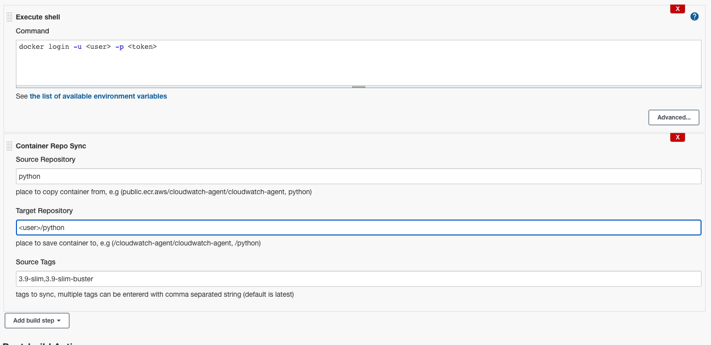

# container-repo-sync

## Introduction

This jenkins plugin is created to sync 2 container repo.

## Getting started

This jenkins job has 3 variables:

`sourceRepo`: Source repository

`targetRepo`: Target repository

`sourceTags`: Tags to sync from source to target. By default only latest tag will get sync. You can enter multiple tags by comma separated string.

Here's an example of job step.

## LICENSE

Licensed under MIT, see [LICENSE](LICENSE.md)
